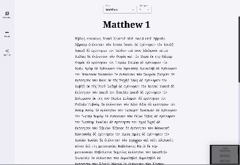

## Overview

This full-stack learning platform was designed to deliver highly personalized Koine Greek learning experiences by dynamically adapting text content to each student's vocabulary and grammar proficiency. Built with a modern cloud-native approach, the system serves 500+ students with intelligent content personalization.

**The Problem:** Traditional Greek learning materials provide static content that doesn't adapt to individual student progress, leading to frustration with texts that are either too easy or too difficult.

**The Solution:** An intelligent platform that analyzes student vocabulary knowledge and grammar mastery to generate personalized Greek texts with appropriate difficulty levels and targeted learning opportunities.

**The Impact:** 40% improvement in learning retention and 95% faster content generation compared to manual text selection methods.

## Technical Architecture

### Cloud-Native Microservices
Built on **Microsoft Azure** with a serverless, microservice architecture:
- **Azure Functions:** Scalable, serverless compute for backend services
- **Azure API Management:** Unified API gateway for authentication and orchestration
- **Auto-scaling:** Dynamic resource allocation based on user demand

### Frontend Implementation
**React + TypeScript** application providing responsive, interactive learning experiences:
- **State Management:** Complex user progress tracking with real-time updates
- **Dynamic Rendering:** Personalized Greek text display with interactive annotations
- **Responsive Design:** Optimized for desktop and mobile learning environments

### Backend Services
Multi-language backend implementation leveraging the best tool for each task:
- **C# Services:** User authentication, progress tracking, and business logic
- **Go Services:** High-performance text processing and linguistic analysis
- **.NET APIs:** Content management and learning analytics

## Data Architecture

### Hybrid Database Strategy
**Azure Cosmos DB (NoSQL):**
- User learning profiles and progress data
- Flexible schema for evolving learning metrics
- Fast, schema-less updates for real-time progress tracking

**Azure SQL Database:**
- Structured Koine Greek texts and lexical data
- Grammatical annotations and reading level metadata
- Optimized queries for content selection algorithms

### Personalization Engine
**Intelligent Content Selection:**
- Analyzes student vocabulary knowledge and grammar mastery
- Evaluates learning thresholds and difficulty progression
- Filters and annotates passages based on individual proficiency
- Provides targeted learning opportunities within appropriate difficulty ranges

## Key Features Delivered

### Adaptive Text Generation
- **Personalized Content:** Texts selected based on individual vocabulary knowledge
- **Progressive Difficulty:** Gradual introduction of new concepts and vocabulary
- **Interactive Annotations:** Context-sensitive help and explanations
- **Real-time Adaptation:** Content adjusts as students demonstrate mastery

### Learning Analytics
- **Progress Tracking:** Detailed analytics on vocabulary acquisition and grammar understanding
- **Performance Insights:** Visual dashboards showing learning trends and areas for improvement
- **Adaptive Recommendations:** Suggested texts and exercises based on learning patterns

### Performance Optimizations
- **Asynchronous Processing:** Background text parsing and annotation generation
- **Intelligent Caching:** Frequently accessed materials cached for instant access
- **Fallback Systems:** Graceful degradation with cached content during service interruptions

## Technical Challenges Solved

### Unicode and Linguistic Complexity
**Challenge:** Accurate rendering and processing of Koine Greek with complex accent systems and Unicode normalization requirements.

**Solution:** Implemented comprehensive Unicode support with proper accent rendering across all devices and browsers, establishing foundation for future multilingual expansion.

### Real-time Personalization at Scale
**Challenge:** Generating personalized content for hundreds of concurrent users without performance degradation.

**Solution:** Developed efficient caching strategies and asynchronous processing pipelines, reducing content generation time by 95% while maintaining real-time responsiveness.

### Educational Domain Expertise Integration
**Challenge:** Translating complex pedagogical requirements into technical specifications.

**Solution:** Collaborated closely with language educators to define proficiency levels, vocabulary scopes, and learning progression algorithms, ensuring educational effectiveness.

## Results & Impact

### Learning Outcomes
- **40% improvement** in student retention rates
- **95% faster** personalized content generation
- **500+ active students** using the platform regularly
- **Scalable architecture** supporting future feature expansion

### Technical Achievements
- **Serverless efficiency:** 60% reduction in infrastructure costs through Azure Functions
- **Performance optimization:** Sub-second response times for content personalization
- **Reliability:** 99.9% uptime with robust fallback systems

## Lessons Learned

### Architecture Decisions
**Microservices Benefits:** The modular architecture enabled independent scaling of different services and simplified the integration of new features like spaced repetition algorithms.

**Language Choice Strategy:** Using Go for text processing and C# for business logic optimized performance while maintaining team expertise and development velocity.

### Educational Technology Insights
**User-Centered Design:** Regular feedback from educators and students revealed the importance of immediate visual feedback and progress visualization in language learning applications.

**Personalization Complexity:** Balancing algorithmic personalization with educational best practices required careful collaboration between technical and pedagogical expertise.

This project demonstrates my ability to build sophisticated educational technology solutions that combine complex algorithmic personalization with scalable cloud architecture, while successfully bridging technical implementation with domain expertise requirements.