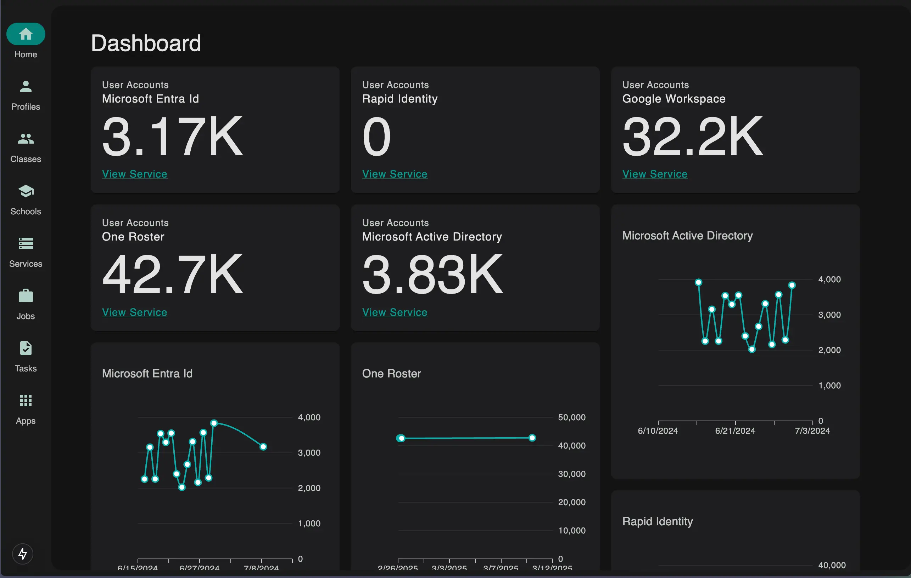

At Warren County Public Schools, I led the design and development of the Identity and Access Monitor, a centralized
platform that provides comprehensive visibility into our Identity and Access Management (IAM) ecosystem, including Entra
ID, Google Workspace, and additional enterprise applications.

This system was developed to address a key operational challenge: the lack of unified insight into account changes and
access discrepancies across multiple platforms. Designed with React and Next.js on the frontend and a robust C#/.NET
backend, the application provides real-time visibility and tooling for our technology department to detect, investigate,
and remediate identity-related issues.

## Challenge and Solution:

One of the most significant technical hurdles was building a reliable and performant way to track and compare changes
across both source and target systems. We implemented a normalized database to persist state snapshots, allowing the
system to identify deviations over time. To maintain performance and reduce redundant database operations, especially
during high-volume background processing, we introduced an in-memory caching layer. This optimization drastically
reduced lookup times and improved overall system efficiency.

## System Architecture Highlights:

* Background workers for continuous synchronization and issue detection
* RESTful API endpoints with strict role-based access control
* Centralized caching to improve performance during batch comparisons

## Soft Skills and Stakeholder Collaboration:

Throughout the project, I worked closely with stakeholders in our technology department to ensure that the tooling met
their practical needs. This included regular feedback loops, feature prioritization based on technician workflows, and
proactive communication to ensure alignment with broader IT goals. I also led technical planning sessions, broke down
complex requirements into actionable tasks, and mentored junior developers involved in the project.

This project demonstrates my ability to design thoughtful, enterprise-ready IAM systems, build performant
infrastructure, and maintain a clear line of communication between technical execution and organizational needs.
